# 芙芙卫士 - 安全态势感知系统

## 项目背景

​	通过网络日志分析，显示站点实时情况

​	包含了日志分析,实时安全检测,文件防篡改,攻击溯源,数据可视化等功能。通过日志处理在网络中实时保护站点安全

## 项目特点 - 简易使用

#### 使用说明

​	开箱即用，直接在v2目录中使用

```shell
python3 app.py
# 开启后直接访问
http://127.0.0.1:5000
```
----

## 相关配置

flume配置文档 - puff_guard.conf

### Kafka相关配置：

启动Kafka内置Zookeeper与Kafka服务(网上说的教程都是骗人的，啥配置也不用写)

```shell
sudo bin/zookeeper-server-start.sh config/zookeeper.properties

sudo bin/kafka-server-start.sh config/server.properties
```

创建Kafka Topic ，随后使用 --list 指令检查是否成功的创建了对应Topic, 也可以使用delete删除

```shell
bin/kafka-topics.sh --create --zookeeper localhost:2181 --replication-factor 1 --partitions 1 --topic puff

bin/kafka-topics.sh --create --zookeeper localhost:2181 --replication-factor 1 --partitions 1 --topic test

bin/kafka-topics.sh --list --zookeeper localhost:2181

bin/kafka-topics.sh --delete --zookeeper localhost:2181 --topic puff
```

最后在Kafka自测过程中，我们可以亲自建立生产者与消费者自测

```shell
bin/kafka-console-producer.sh --broker-list localhost:2181 --topic puff

bin/kafka-console-consumer.sh --bootstrap-server localhost:9092 --topic puff --from-beginning
```

----

flume唯一操作：启动flume（此处）

```shell
bin/flume-ng agent \
--name a1 \
--conf conf \
--conf-file conf/flume-conf.properties.template \
-Dflume.root.logger=INFO,console

bin/flume-ng agent \
--name a1 \
--conf conf \
--conf-file conf/kafka.properties \
-Dflume.root.logger=INFO,console
```

----

kafka ： /opt/kafka

flume ： /usr/local2/flume

kafka-python ： /usr/local2/sca (基础的python调用生产者与消费者)

另外需要自己安装好redis等相关组件，不能自己

上述为各个组件位置

## 当前任务列表

#### 进行中 : 

​	1 BP神经网络流量预测
​        需要讨论流量预测的表现形式

#### ToDo :

​	1 爱因斯坦计划-杀伤链 & 攻击树
​        计划主要为前端页面显示

#### 已完成 : 

1 溯源取证

​	实现手法:通过存储恶意流量的IP地址,同时开启定位,在交互界面可以显示分布概述.

2 可视化数据监控

​	通过echart可以友好的显示在服务器的展示界面中.

3 镜像替身防篡改

​    使用哈希检验保证文件完整性,可以实时显示网站文件改动情况,第一时间定位问题可以通过图表与数据第一时间得知当前系统情况

4 防篡改功能前端显示

​	通过Echart展示文件数据的历史变化曲线

## 项目界面介绍

#### 欢迎界面

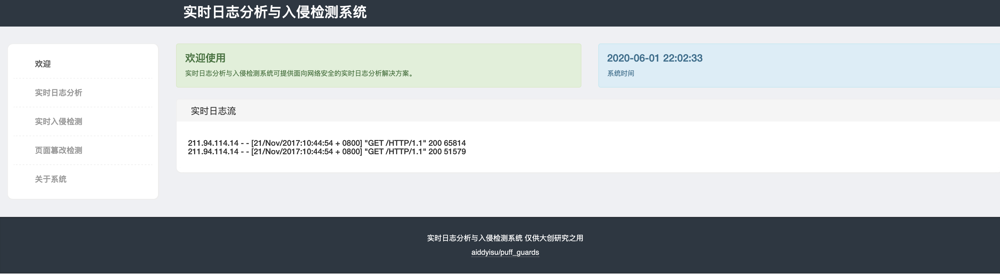

可以在欢迎界面看到系统时间，以及实时日志流

#### 分析界面

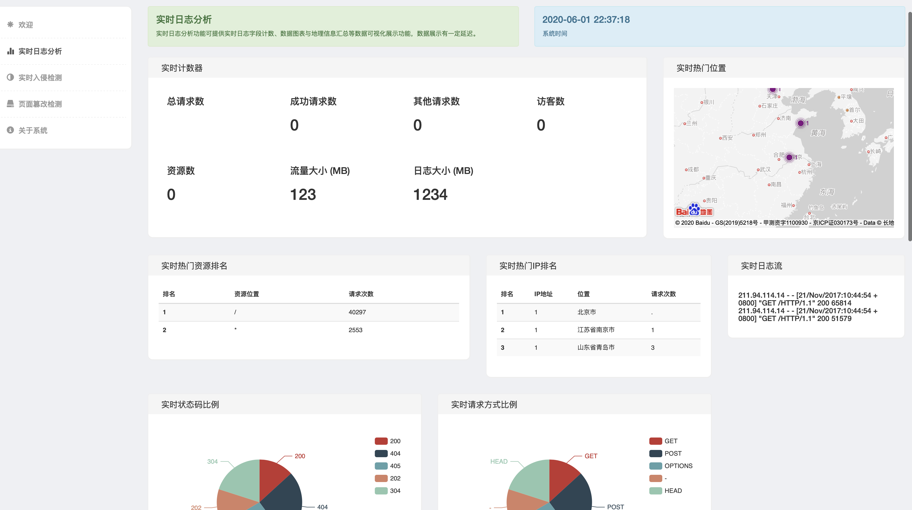

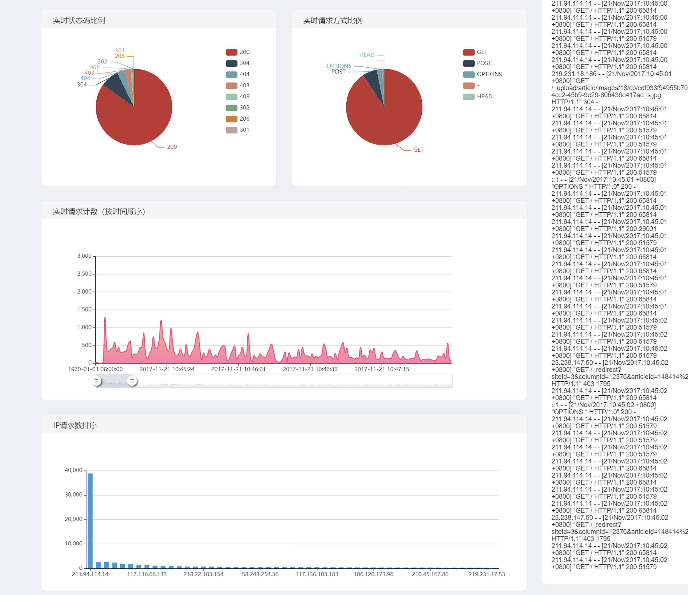

日志分析界面，可以看出历史统计，包括哪些IP高频访问，历史流量规模等等，可以通过此列表判断历史访问请求

#### 地理位置分析

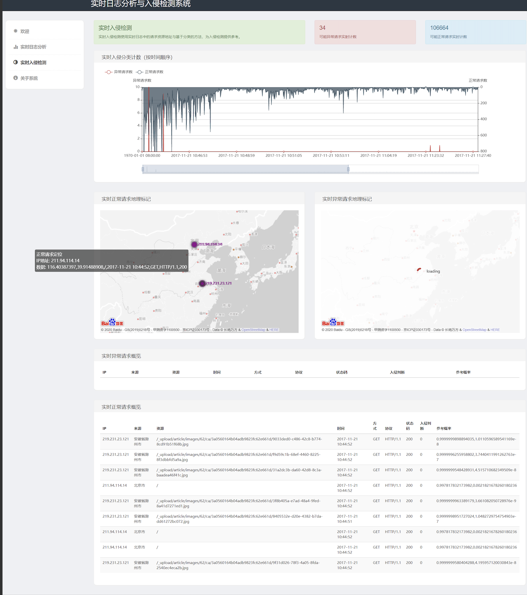

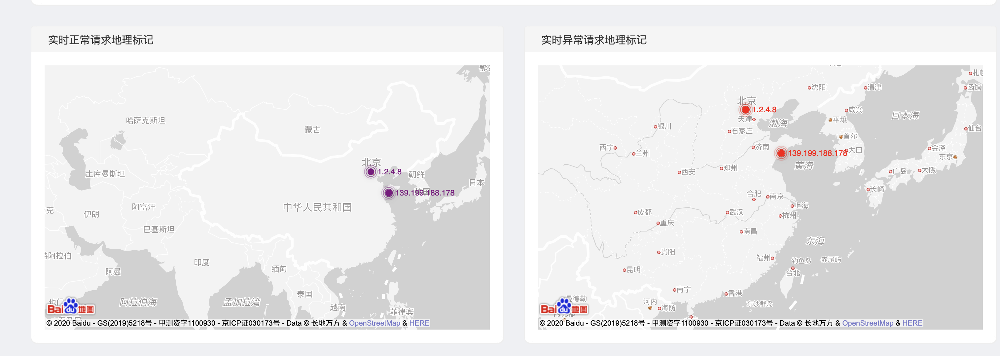

在实时入侵检测界面可以实时分析IP地理位置进行攻击溯源，同时可以显示当时访问日志流，同时对其地理位置进行溯源

#### 文件安全检测

#### 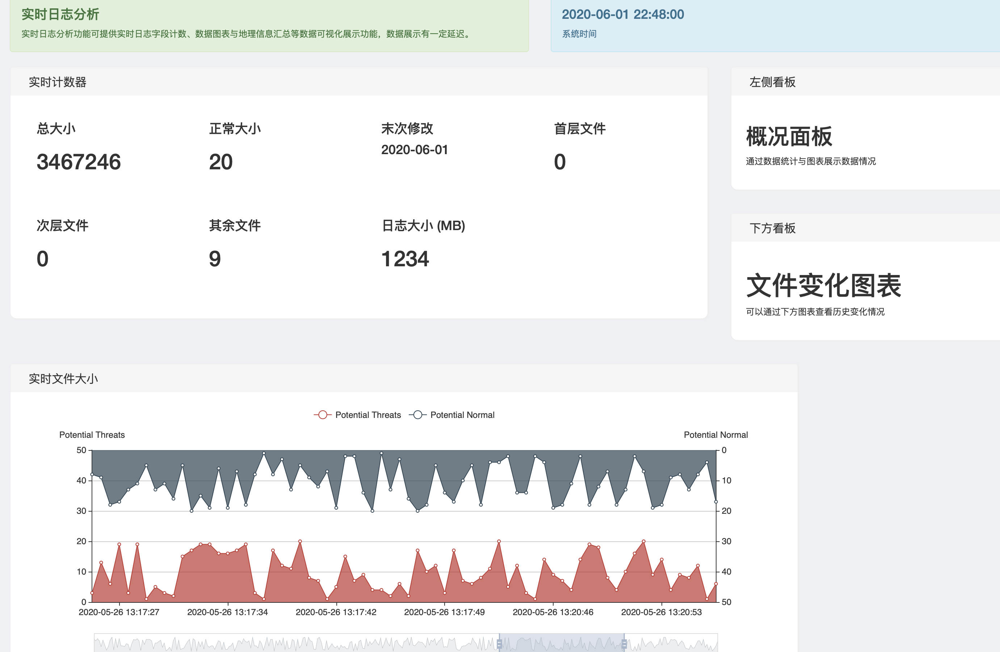

通过文件安全检测可以看出当前系统总大小，文件数量，最后一次修改时间，各层级文件数量，网络流量日志的大小

#### 文件历史折线图

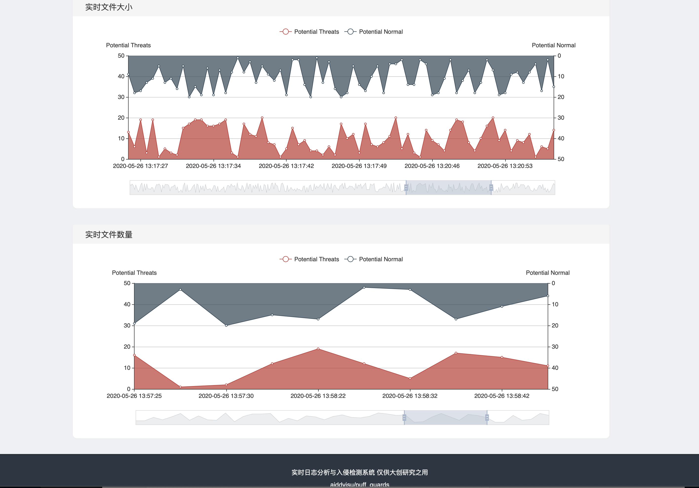

通过文件大小历史折线图，文件数量历史折线图展示网站修改历史

## 系统架构

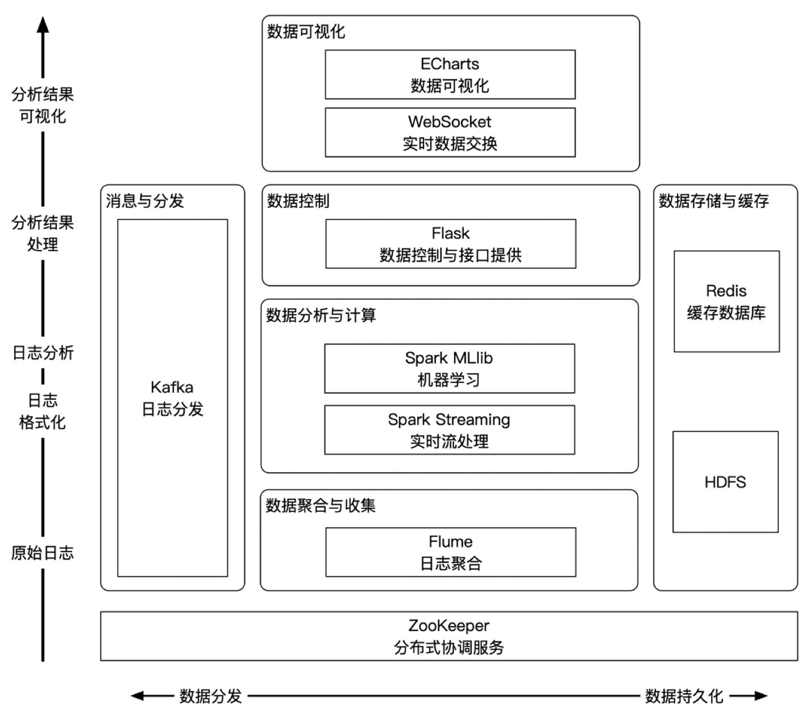

系统架构图通过由flume底层获取数据联动至flask-socket，前端ECharts数据可视化处理。

从flume获取日志信息，分发给kafka消息队列

#### 数据流

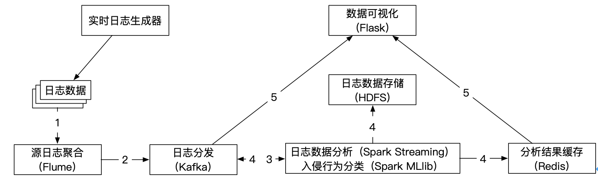

#### 训练流

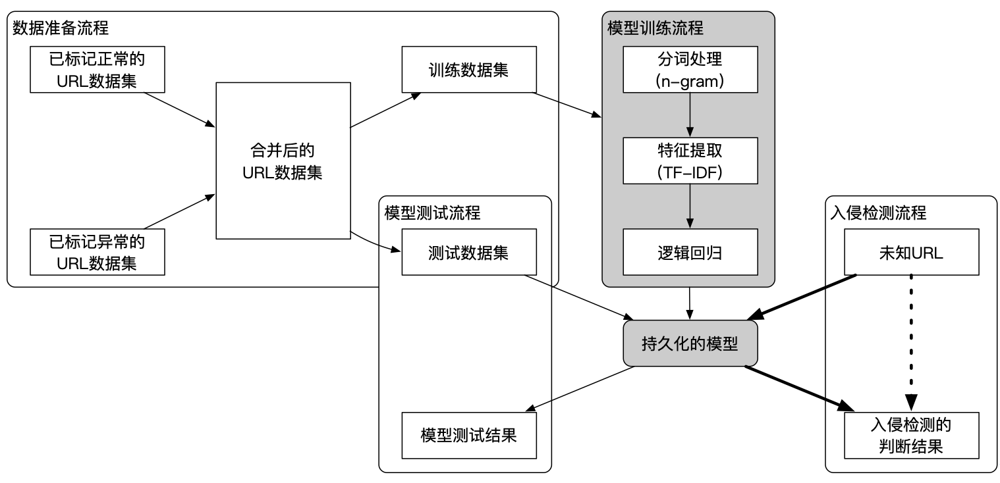

机器学习过程

#### 数据样例

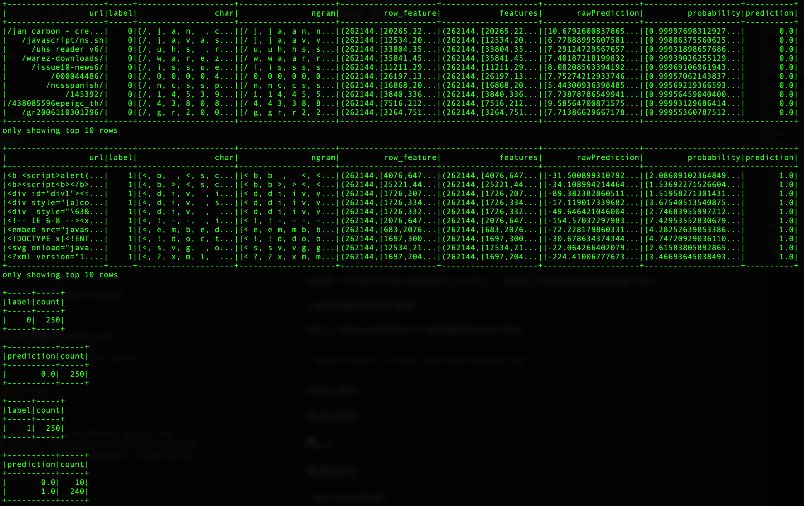

上图为数据库数据样例

## 结语

有任意意见还希望各位多多指出，还有很多细节需要讨论